# 01 Reverse an Array

In this challenge the problem domain was to take a given array and reverse the values inside

## WhiteBoard Process

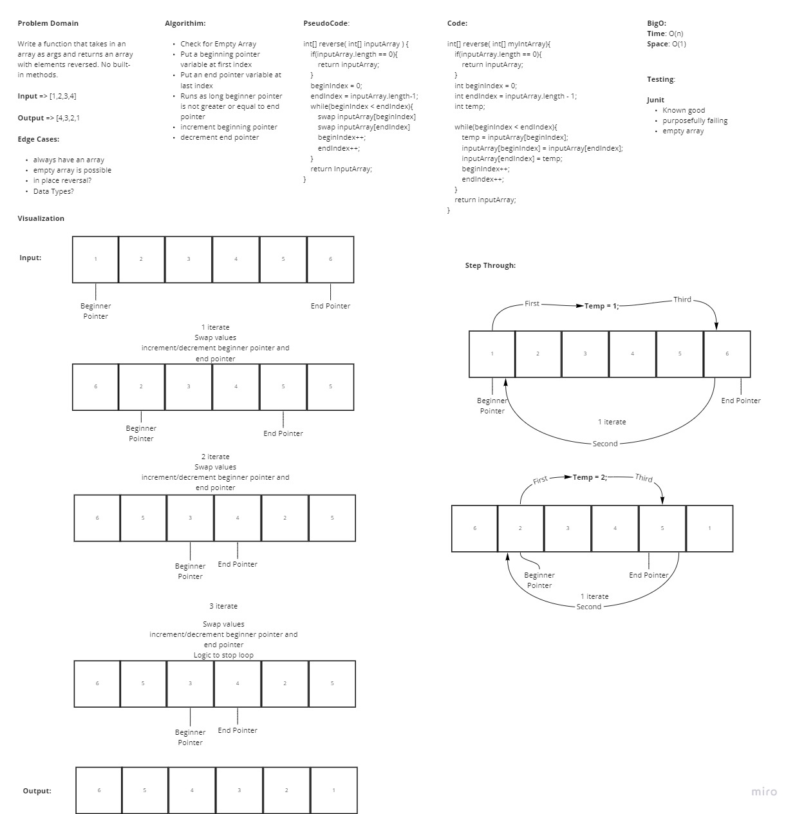

## Approach & Efficiency

In this approach we aim a beginning and end pointer variable to the first and last value in the array. We then swap the two values using a third temp variable in iterations while incrementing/decrementing the pointers until all values inside the array have been hit. At most this method is using O(n) timing due to utilizing a loop.

---

# 02 Insert to Middle of an Array

In this challenge the problem domain was to take a given array and insert the given value into the center of the array

## WhiteBoard Process

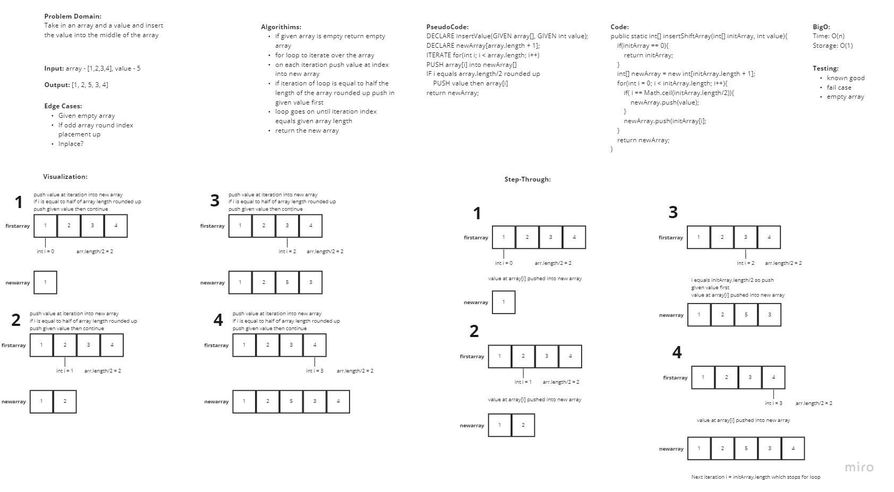

## Approach & Efficiency

In this approach I decided to create a new array that will take in the values of the initial array. I iterated over the initial array and copied the values at that iteration into the new array. If the iteration equaled to half the initial array length rounded up then the given value was pushed into first then continued on. After adding the extra value I had to take into account the shift to the right and added 1 to the future indexes. Once the loop ended the function then returned the new array. The efficiency should be O(n) timing since a single for loop was used.

---

# 03 Insert to Middle of an Array

In this challenge the problem domain was to take a given array and a given key value and implement a binary search through the array and return the index

## WhiteBoard Process

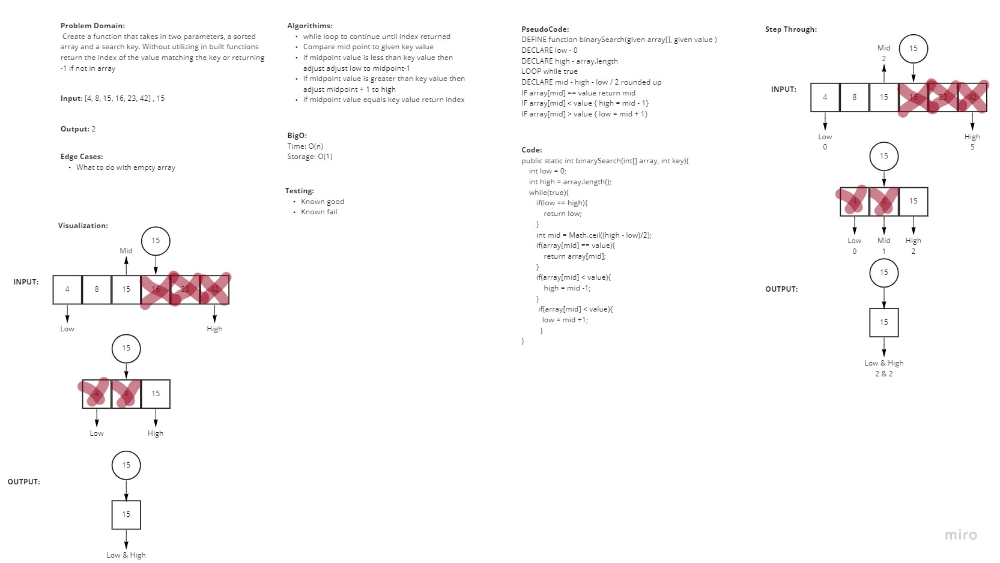

## Approach & Efficiency

In my approach I decided to set values for the first index and the last index in the given array. These values helped to alter the midpoint which was what I was comparing the key to. If the key was greater than the midpoint value then the low point was moved up to cut out the entire left side of the array and vice versa if the key was less than the midpoint. If the array value equalled the key or if the lowpoint matched the highpoint I returned the index of the array value.

---

# 04 Fibonacci at nth Value

In this challenge the problem domain was to find the value of the fibonacci sequence at the given nth value

## WhiteBoard Process

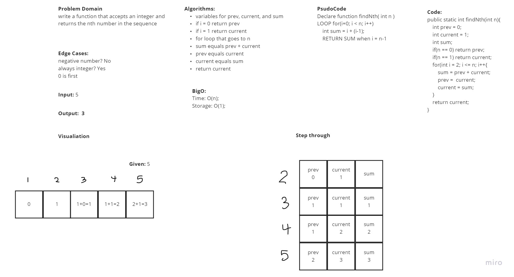

## Approach & Efficiency

During this interview I started out really strong and was able to present my ideas and thought processes very well. Halfway through I got hung up and the algorithm for the function. I was on the right track but had issues with keeping track of the prev/current values. After adjusting I was able to complete everything. Abdulahi was my grader for this interview

---

#  05 Linked List

In this challenge the problem domain was to create three methods to add to linked list, get index of given value, and override toString method.

## WhiteBoard Process

For this challenge we created Single Linked list and created 3 methods that allow us to insert a node, get value of nth node, and print out a string representation of the list

## Approach & Efficiency

In this challenge the key focus was ensuring that I always had a reference to the head node and figuring out how to manage the pointers allowed me to move the nodes around without losing any of the nodes. We are starting to implement the use of classes a lot more and explore the functionality that they provide.

---

#  06 Linked List Extended

In this challenge the problem domain was to add another 3 methods that allows you to append a new node to the end of the linked list, insert a new node before given match value, and insert a new node after given match value.

## WhiteBoard Process

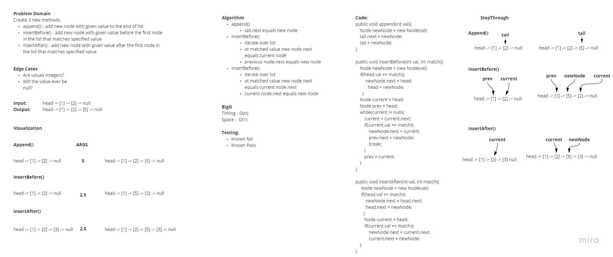

## Approach & Efficiency

In this challenge the key focus was ensuring that I always had a reference to the head node and figuring out how to manage the pointers allowed me to move the nodes around without losing any of the nodes. We are starting to implement the use of classes a lot more and explore the functionality that they provide.

---

#  07 Linked List Extended

In this challenge the problem domain was to return the value of the node that was k away from the tail in the list

## WhiteBoard Process

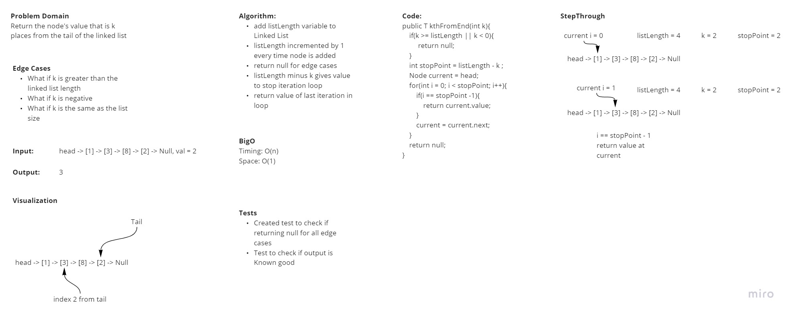

## Approach & Efficiency

In this challenge I decided to add another property to our LinkedList class that tracks how many nodes are added to the list. This made approaching the kthFromEnd() method much easier to navigate. Knowing the size of the list I was able to subtract the given argument from the size and iterate through the list to that resulting value.

---

#  08 Linked List Extended

In this challenge the problem domain was to add a method to linked list that will take in another list as an argument and zip join it into the list calling the method.

## WhiteBoard Process

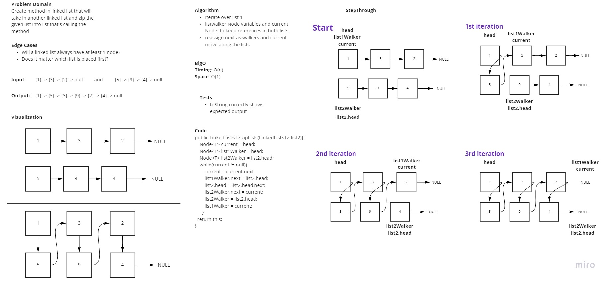

## Approach & Efficiency

In this challenge the way I approached this problem was by creating 3 pointers that will walk down both lists. These pointers serve as temporary placeholders so that none of our nodes are lost when changing a nodes next property.

---

#  09 Stacks and Queue

In this challenge the problem domain was to create Stack and Queue classes that contain methods to add, delete, peek, and check if the data structure is empty.

## WhiteBoard Process

N/A

## Approach & Efficiency

I was able to complete all methods for Stacks and Queues. All methods have an O(1) Time performance.

#  11 PseudoQueue

In this challenge the problem domain was to create a PseudoQueue class that still followed the first in first out principle but used two stacks in order to implement the functionality.

## WhiteBoard Process

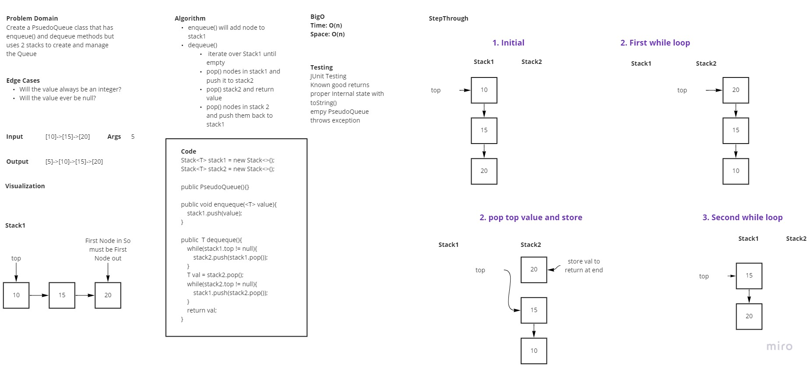

## Approach & Efficiency

The way I approached this was by pushing everything into the first stack when calling the enqueue() function. In order to return the value at the bottom of the stack I popped all the values out of stack1 while simultaneously pushing them into stack2. This makes the previously bottom value the top of stack2. I then popped and stored that value to return later after pushing everything back into stack1.

#  12 Animal Shelter

In this challenge the problem domain was to create a new class called Animal Shelter that holds cat and dog objects. It operates in a first in, first out basis. It contains an enqueue() to add animal objects and a dequeue() that takes in a string dog/cat and pulls the first object out of the queue that matches.

## WhiteBoard Process

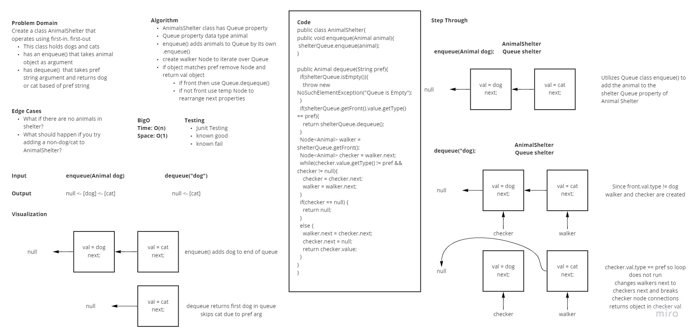

## Approach & Efficiency

In this code challenge I decided to store the animal objects in a queue to follow the first in first out operation. This allowed me to make enqueue() work naturally. For Dequeque if the pref matched the front a normal dequeue() from the Queue class would return the correct Animal object. If that match was later in the queue then pointers were needed to reasign the next properties in order to pull the node out of the queue and return the animal object inside it.

#  13 Bracket Validation

In this challenge the problem domain was to create a function that takes in a string and returns true if the String has balanced brackets and false if it didn't.

## WhiteBoard Process

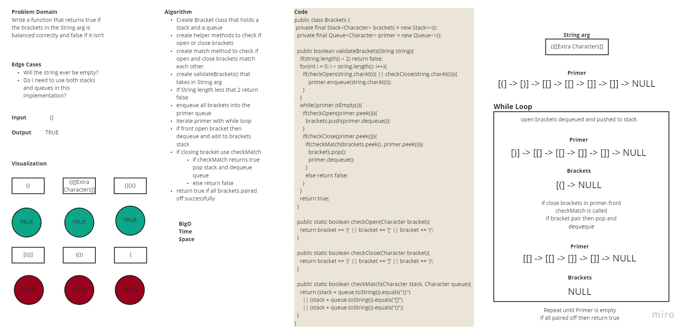

## Approach & Efficiency

In this code challenge I created a Bracket class that holds a Stack and a Queue. I also added three helper methods checkOpen(), checkClose(), and checkMatch() that are used in bracketValidation(). The three helper methods are used to check if the given character is open/closed and or if the two given characters make a valid bracket pair. A while loop is used to iterate over the queue and if the front is an open bracket it will dequeque it and push it to the stack. If the front is a closing bracket then it will check if the top of the stack and the front of the queue make a valid bracket pair. If checkMatch returns true it will call a pop and dequeue and if not then it will return false. If all brackets are paired off successfully the function will return true.

#  15 Trees

In this challenge the problem domain was to create a new TreeNode, BinaryTree, and BinarySearchTree class. BinarySearchTree extends BinaryTree and contains two more methods for add() and contain()

## WhiteBoard Process

N/A

## Approach & Efficiency

In this code challenge I chose to use recursion in all the methods in order to travers through the trees. I made BinaryTree Generic and made BinarySearchTree extend BinaryTree<Integers> so that it inherited all of its properties and methods.

#  16 Max Value Search

In this challenge the problem domain was to find the max integer value in the binary tree and return it.

## WhiteBoard Process

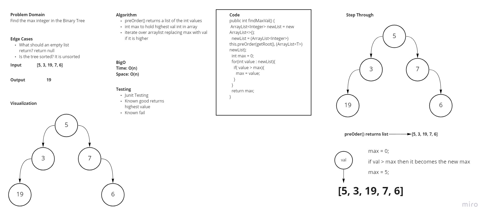

## Approach & Efficiency

In this code challenge I used the preOrder built in method to return a list of all the values in the binary tree. I then iterated over the list and return the max value inside it.

#  17 Breadth First Search

In this challenge the problem domain was travers through the binary tree using a breadth traversal

## WhiteBoard Process

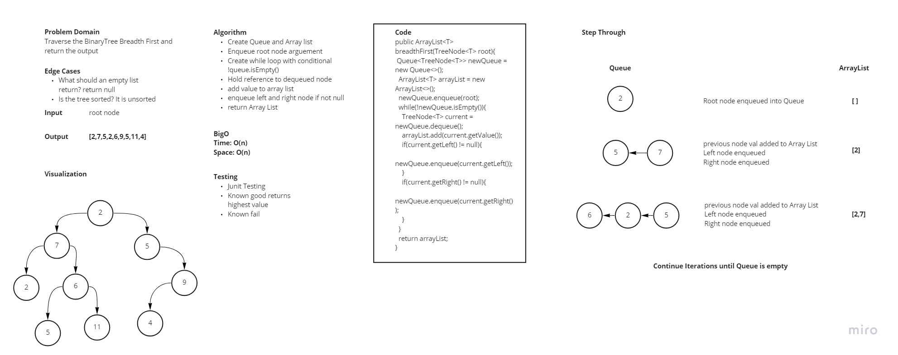

## Approach & Efficiency

In this code challenge I set up a Queue and an Array List. The queue first enqueues the root that was passed in as an argument. A while loop will then store the saved node in a variable current. The value in that node is pushed into the array list and if the left and right nodes are not null they will be enqueued in that order. This loop will run until the queue is empty signifying that all the nodes have been hit. Returning the list in the end.

#  18 K-ary Tree FizzBuzz

In this challenge the problem domain was to create a K-ary tree and Node class with a method called fizzBuzz(). The fizz buzz method should traverse through the tree and return a new tree with all 3's replaced with Fizz, 5's replaced with Buzz, 3 and 5 with FizzBuzz, and the int as a string if it was neither of the above options

## WhiteBoard Process

## Approach & Efficiency

I decided to approach this challenge recursively. I created a function that calles a recursive method that will traverse through the tree until it hits a node with no children. At each point in the recursion a temp node is created and once the base case is hit the value will be checked with a fizzBuzz() helper function. The returned node will be added to its parents node and once all children are hit the current nodes value will call the fizzBuzz() method and continue along the call stack.

#  18 HashMap

This code challenge was to create our own HashTable/HashMap

## WhiteBoard Process

N/A

## Approach & Efficiency

I ended up approaching this code challenge in two different ways. The first way was more geared towards the lab requirments where the key was hashed and the value was stored at the hashed key index. This led me to some issues with how I would track the keys after storing them and decided to have a set to keep track of them. The second way I went over with Ben on how they approached it in the last class. The second way has an Array List that has a linked list that holds a class HashMapPair holding key value pairs. This approach is able to handle collisions by adding key value pairs as the next node in the linked list.
