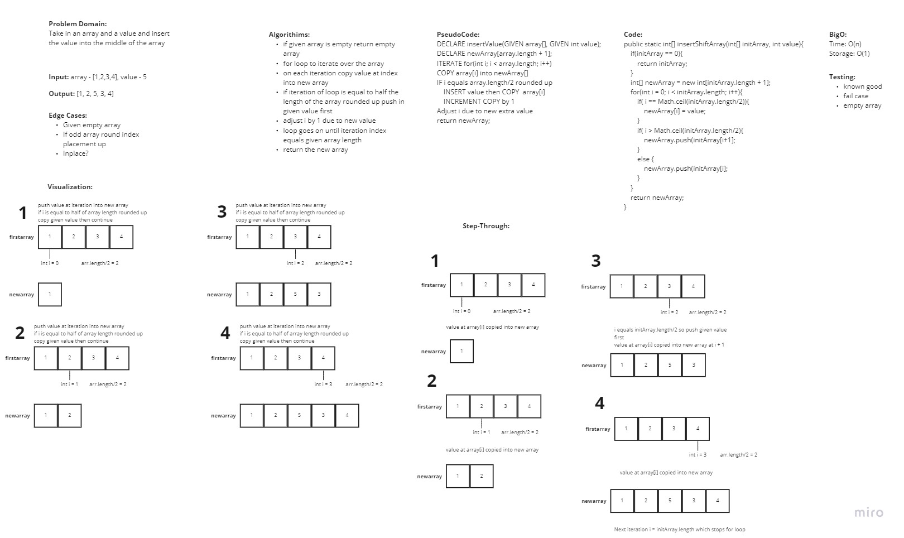

# 01 Reverse an Array

In this challenge the problem domain was to take a given array and reverse the values inside

## WhiteBoard Process

## Approach & Efficiency

In this approach we aim a beginning and end pointer variable to the first and last value in the array. We then swap the two values using a third temp variable in iterations while incrementing/decrementing the pointers until all values inside the array have been hit. At most this method is using O(n) timing due to utilizing a loop.

---

# 02 Insert to Middle of an Array

In this challenge the problem domain was to take a given array and insert the given value into the center of the array

## WhiteBoard Process

## Approach & Efficiency

In this approach I decided to create a new array that will take in the values of the initial array. I iterated over the initial array and copied the values at that iteration into the new array. If the iteration equaled to half the initial array length rounded up then the given value was pushed into first then continued on. After adding the extra value I had to take into account the shift to the right and added 1 to the future indexes. Once the loop ended the function then returned the new array. The efficiency should be O(n) timing since a single for loop was used.

---

# 03 Insert to Middle of an Array

In this challenge the problem domain was to take a given array and a given key value and implement a binary search through the array and return the index

## WhiteBoard Process

## Approach & Efficiency

In my approach I decided to set values for the first index and the last index in the given array. These values helped to alter the midpoint which was what I was comparing the key to. If the key was greater than the midpoint value then the low point was moved up to cut out the entire left side of the array and vice versa if the key was less than the midpoint. If the array value equalled the key or if the lowpoint matched the highpoint I returned the index of the array value.

---

# 04 Fibonacci at nth Value

In this challenge the problem domain was to find the value of the fibonacci sequence at the given nth value

## WhiteBoard Process

## Approach & Efficiency

During this interview I started out really strong and was able to present my ideas and thought processes very well. Halfway through I got hung up and the algorithm for the function. I was on the right track but had issues with keeping track of the prev/current values. After adjusting I was able to complete everything. Abdulahi was my grader for this interview

---

#  05 Linked List

In this challenge the problem domain was to create three methods to add to linked list, get index of given value, and override toString method.

## WhiteBoard Process

For this challenge we created Single Linked list and created 3 methods that allow us to insert a node, get value of nth node, and print out a string representation of the list

## Approach & Efficiency

In this challenge the key focus was ensuring that I always had a reference to the head node and figuring out how to manage the pointers allowed me to move the nodes around without losing any of the nodes. We are starting to implement the use of classes a lot more and explore the functionality that they provide.

---

#  06 Linked List Extended

In this challenge the problem domain was to add another 3 methods that allows you to append a new node to the end of the linked list, insert a new node before given match value, and insert a new node after given match value.

## WhiteBoard Process

## Approach & Efficiency

In this challenge the key focus was ensuring that I always had a reference to the head node and figuring out how to manage the pointers allowed me to move the nodes around without losing any of the nodes. We are starting to implement the use of classes a lot more and explore the functionality that they provide.

---

#  07 Linked List Extended

In this challenge the problem domain was to return the value of the node that was k away from the tail in the list

## WhiteBoard Process

## Approach & Efficiency

In this challenge I decided to add another property to our LinkedList class that tracks how many nodes are added to the list. This made approaching the kthFromEnd() method much easier to navigate. Knowing the size of the list I was able to subtract the given argument from the size and iterate through the list to that resulting value.

---

#  08 Linked List Extended

In this challenge the problem domain was to add a method to linked list that will take in another list as an argument and zip join it into the list calling the method.

## WhiteBoard Process

## Approach & Efficiency

In this challenge the way I approached this problem was by creating 3 pointers that will walk down both lists. These pointers serve as temporary placeholders so that none of our nodes are lost when changing a nodes next property.
