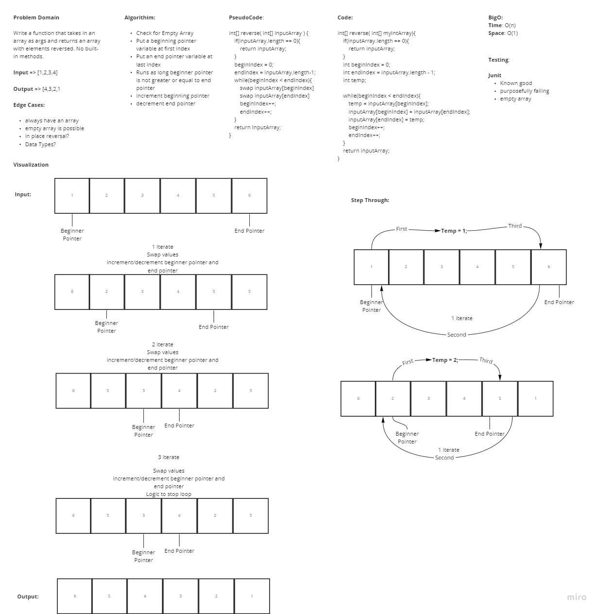

# Reverse an Array

In this challenge the problem domain was to take a given array and reverse the values inside

## WhiteBoard Process

## Approach & Efficiency

In this approach we aim a beginning and end pointer variable to the first and last value in the array. We then swap the two values using a third temp variable in iterations while incrementing/decrementing the pointers until all values inside the array have been hit. At most this method is using O(n) timing due to utilizing a loop.
