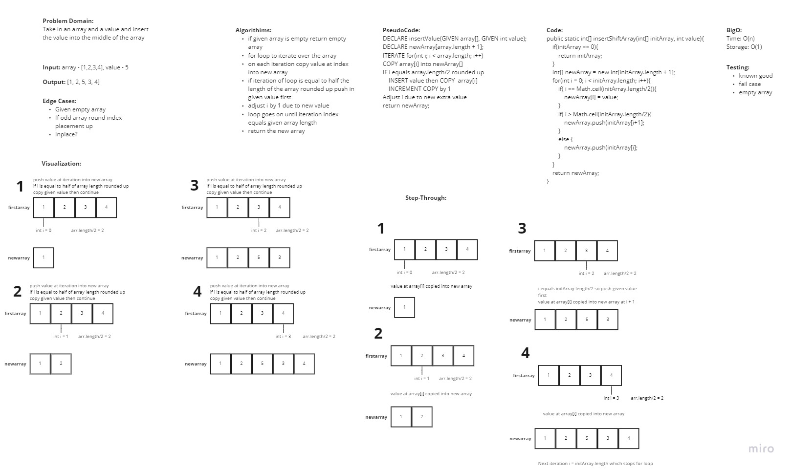

# Insert to Middle of an Array

In this challenge the problem domain was to take a given array and insert the given value into the center of the array

## WhiteBoard Process

## Approach & Efficiency

In this approach I decided to create a new array that will take in the values of the initial array. I iterated over the initial array and copied the values at that iteration into the new array. If the iteration equaled to half the initial array length rounded up then the given value was pushed into first then continued on. After adding the extra value I had to take into account the shift to the right and added 1 to the future indexes. Once the loop ended the function then returned the new array. The efficiency should be O(n) timing since a single for loop was used.
