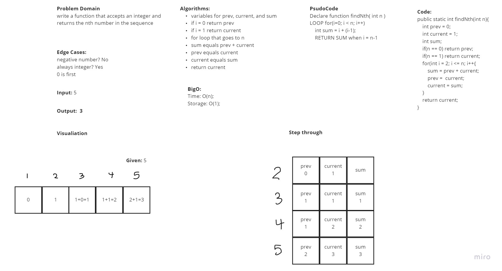

# Fibonacci at nth Value

In this challenge the problem domain was to find the value of the fibonacci sequence at the given nth value

## WhiteBoard Process

## Approach & Efficiency

During this interview I started out really strong and was able to present my ideas and thought processes very well. Halfway through I got hung up and the algorithm for the function. I was on the right track but had issues with keeping track of the prev/current values. After adjusting I was able to complete everything. Abdulahi was my grader for this interview

